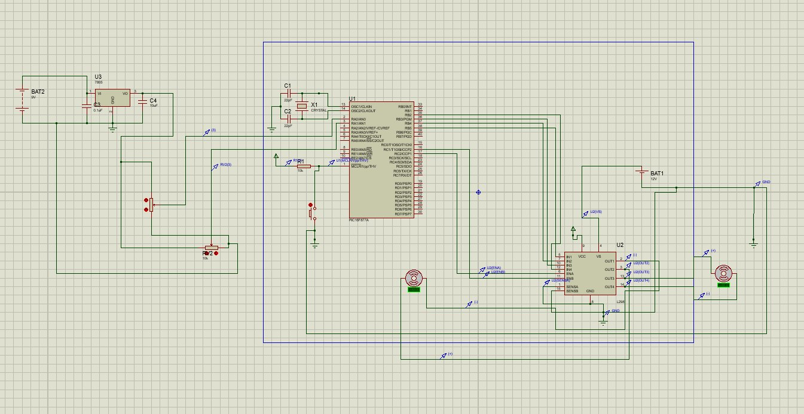

# Joystick-Controlled DC Motor System using PIC16F887A

This embedded systems project uses a **PIC16F887A microcontroller**, a **2-axis joystick**, and two **DC motors** driven by an **L298 dual H-bridge motor driver**. The system reads analog joystick inputs and adjusts motor speed and direction accordingly using PWM signals.

---

## 🔧 Components Used

- PIC16F887A Microcontroller
- L298 Motor Driver IC
- 2 DC Motors
- Joystick Module (X/Y axis)
- 12V and 9V Power Supplies
- Capacitors, resistors, LEDs
- Crystal oscillator (20MHz)
- Proteus 8.0 (for simulation)

---

## 🧠 How It Works

1. **Joystick Input**: The joystick outputs analog voltage levels (0–5V) depending on its X/Y tilt.
2. **ADC**: The PIC microcontroller reads analog values using its ADC module.
3. **PWM Control**: Based on the ADC result, the motors are controlled via PWM for variable speed and direction.
4. **L298**: Dual H-Bridge motor driver receives PWM + direction signals to drive the motors.

---

## 📂 Files

| File | Description |
|------|-------------|
| `Last_Last.c` | Embedded C code for PIC16F887A |
| `proteus/circuit-diagram.jpg` | Schematic diagram for simulation |
| `docs/explanation.md` | Extended explanation of the system |
| `LICENSE` | MIT License (or your preferred license) |

---

## 🚀 Getting Started

### Requirements

- MPLAB X IDE
- XC8 Compiler
- Proteus 8.0 or later for simulation

### Steps

1. Open `main.c` in MPLAB X.
2. Compile using XC8.
3. Load the `.hex` file into the Proteus microcontroller.
4. Simulate with joystick interaction to observe motor behavior.

---

## 📜 License

This project is licensed under the MIT License.

note: other initial tryout codes were included for documentation (they don't work), only the Last_Last.c file should be considered  
